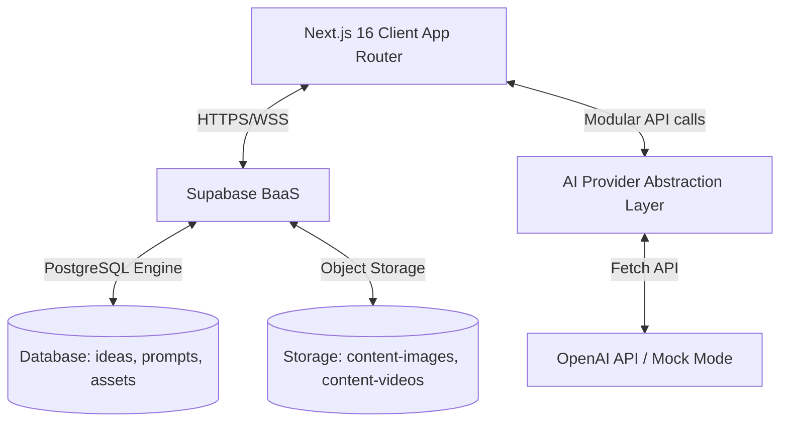
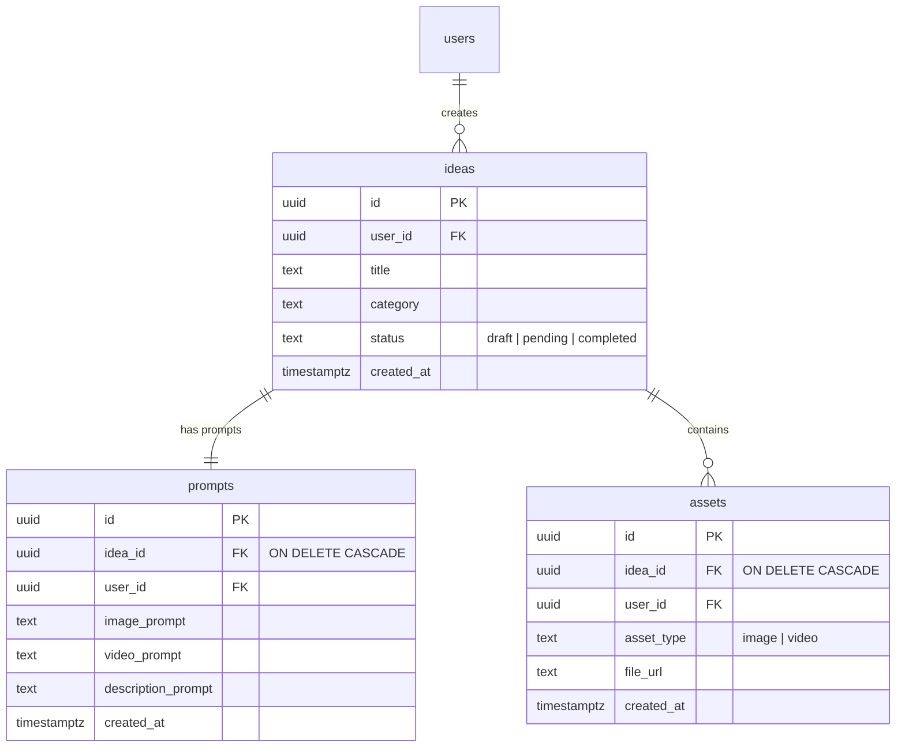

# Project Architecture & Design System

The **AI Content Factory** is designed as a production-grade, multi-tenant content management system. It demonstrates full-stack software engineering principles, incorporating modular design patterns, strict database security models, and autonomous workflow abstractions.

---

## 🏗️ Architectural Overview

The application follows a decoupled three-tier architecture:



1. **Presentation Layer**: Built on **React 19** and **Next.js 16 (App Router)**, styled with **Tailwind CSS v4** featuring custom glassmorphism. Routing is strictly auth-guarded.
2. **Backend-as-a-Service (BaaS) Layer**: Managed entirely via **Supabase**, utilizing PostgreSQL for relational storage, Supabase Auth for sessions, and Supabase Storage for digital assets.
3. **AI Services Integration Layer**: Leverages a **Provider Design Pattern** to resolve modular text-generation systems (swapping between simulation and live OpenAI endpoints dynamically).

---

## 📂 Production Folder Structure

We use a modular, directory-based structure to segregate responsibilities:

```text
ai-content-factory/
├── app/                  # Next.js App Router (pages, layouts, globals)
│   ├── dashboard/        # Auth-guarded control center pages
│   │   ├── assets/       # Media Upload & Gallery boards
│   │   ├── ideas/        # Content CRUD view
│   │   ├── prompts/      # AI prompt scripting view
│   │   └── settings/     # System setups & reset consoles
│   ├── globals.css       # Core Tailwind CSS & Glassmorphic variables
│   ├── layout.tsx        # Base markup & context wrappers
│   └── page.tsx          # Authentication gate (Login / Signup)
├── components/           # Reusable layout and UI modules
│   ├── Header.tsx        # Top status and navigation header
│   └── Sidebar.tsx       # Side dashboard drawer & desktop navigation
├── hooks/                # Centralized state/context wrappers (e.g. useAuth)
├── lib/                  # Service clients and integrations
│   ├── ai/               # AI engines (interfaces, Mock and OpenAI providers)
│   └── supabase/         # Supabase client setup & Auth/Storage helpers
├── services/             # Automation workflows and business execution scripts
├── supabase/             # Database management folders
│   └── migrations/       # SQL schemas, constraints, and security policies
├── types/                # Shared TypeScript structures (index.ts)
├── utils/                # General utility helper functions
└── docs/                 # Specialized system manuals & guides
```

---

## 💾 Relational Database Schema & Row Level Security

The application utilizes a **PostgreSQL** database hosted on Supabase. Relational tables are strictly protected by **Row Level Security (RLS)**, ensuring users can never access or modify data belonging to other accounts.

### Entity Relationship Diagram



### Row Level Security (RLS) Policies

All tables have RLS enabled. The security policies verify user authenticity using `auth.uid()`:

* **Select**: `auth.uid() = user_id` (Ensures tenants only read their own rows).
* **Insert**: `auth.uid() = user_id` (Verifies users only write rows bound to their UUID).
* **Update/Delete**: `auth.uid() = user_id` (Prevents cross-tenant modifications).

Furthermore, the storage buckets (`content-images` and `content-videos`) are governed by equivalent policies, verifying that files are uploaded to and deleted from folders named after the user's authenticated UUID.

---

## ⚡ AI Layer: The Provider Design Pattern

To prevent developer lock-in and avoid mandatory API costs during development, the AI integration utilizes the **Provider Design Pattern**:

1. **`AIProvider` Interface**: Specifies the contract required for content generation:
   ```typescript
   export interface AIProvider {
     generateIdea(topic?: string, category?: string): Promise<{ title: string; category: string; description: string }>;
     generatePrompt(ideaTitle: string, category: string): Promise<{ image_prompt: string; video_prompt: string; description_prompt: string }>;
     generateDescription(ideaTitle: string): Promise<string>;
   }
   ```
2. **`MockAIProvider`**: Simulates natural latency using timers, returning rich, pre-written arrays of data. This allows developers to test the application for free.
3. **`OpenAIProvider`**: Uses standard fetch commands to query OpenAI's chat completions API (`gpt-4o-mini`), parsing strict JSON schemas.
4. **`getAIProvider()` Factory**: Validates environment variables. If `OPENAI_API_KEY` is not present, is set to `MOCK_MODE`, or fails standard validation, it automatically resolves to `MockAIProvider`.

---

## 🔄 Automation Workflows Console

The services layer (`services/workflows.ts`) implements background automations that represent common cron jobs or event triggers:

```mermaid
sequenceDiagram
    participant UI as Dashboard UI
    participant WS as Workflows Service
    participant DB as Supabase DB
    participant AI as AI Provider
    
    rect rgb(20, 24, 33)
        note right of UI: Workflow 1: Daily Ideation
        UI->>WS: generateDailyContentIdeas(userId)
        WS->>AI: generateIdea()
        AI-->>WS: Return catchy content drafts
        WS->>DB: Insert into 'ideas' (status: 'draft')
        WS-->>UI: Return count & brainstormed list
    end
    
    rect rgb(29, 23, 38)
        note right of UI: Workflow 2: Auto-Script Drafts
        UI->>WS: generatePromptsForPendingIdeas(userId)
        WS->>DB: Query ideas where status = 'draft'
        DB-->>WS: List of drafts
        loop For each draft
            WS->>AI: generatePrompt(title, category)
            AI-->>WS: Return visual scripts & captions
            WS->>DB: Save to 'prompts' and set idea status to 'pending'
        end
        WS-->>UI: Return count of scripted ideas
    end
    
    rect rgb(18, 30, 24)
        note right of UI: Workflow 3: State Advancer
        UI->>WS: moveCompletedAssetsToReady(userId)
        WS->>DB: Query ideas where status = 'pending'
        DB-->>WS: List of pending ideas
        loop For each pending idea
            WS->>DB: Check if linked assets exist in 'assets' table
            DB-->>WS: Asset record matches
            WS->>DB: Update idea status to 'completed'
        end
        WS-->>UI: Return updated ideas IDs
    end
```


